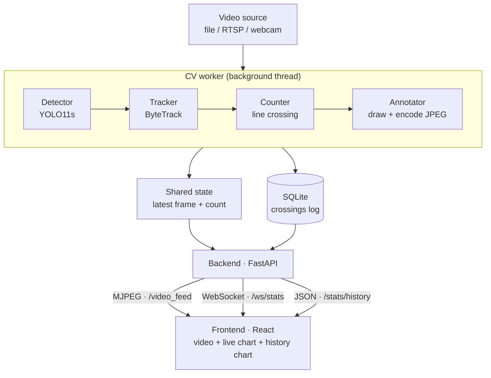

# 🚦 Traffic Analytics

Real-time vehicle **detection, tracking, and counting** from traffic video, served as a live full-stack web dashboard.

A video source is processed by a YOLO11s + ByteTrack pipeline running in a background thread. Vehicles crossing a virtual line are counted exactly once each and logged to a database. A FastAPI backend streams the annotated video and pushes live statistics, while a React dashboard shows the live feed, a real-time count chart, and a historical traffic chart.

---

## 📸 Demo


<!-- Save your dashboard screenshot as docs/dashboard.png so it shows up here -->

---

## ✨ Features

- **Vehicle detection** (car, motorcycle, bus, truck) with YOLO11s
- **Multi-object tracking** with persistent IDs via ByteTrack
- **Line-crossing counter** — each vehicle is counted exactly once, no double counting
- **Decoupled architecture** — heavy CV runs in a background thread and never blocks the web server
- **Live MJPEG video stream** rendered directly in the browser
- **Live count over WebSocket** + a real-time line chart
- **Persistent storage** (SQLite) with a historical per-minute traffic chart
- **Standalone CLI** for offline video processing

---

## 🏗️ Architecture

The core design principle: the CV engine (detect → track → count) is fully decoupled from the web layer. The worker writes its latest result to a shared state; the web layer only reads from it. The two never block each other.



---

## 🛠️ Tech stack

**Backend:** Python · Ultralytics YOLO11s · OpenCV · FastAPI · Uvicorn · SQLite

**Frontend:** React · Vite · Recharts

---

## 📂 Project structure

```
traffic-analytics/
├── core/
│   ├── detector.py     # VehicleDetector — YOLO11s + ByteTrack, returns clean detections
│   └── counter.py      # LineCounter — line-crossing logic, counts each ID once
├── video/
│   └── annotator.py    # draw boxes, labels, counting line, count overlay
├── backend/
│   ├── server.py       # FastAPI app: video feed, WebSocket, history endpoints, CORS
│   ├── worker.py       # background thread running the CV pipeline
│   └── state.py        # thread-safe shared state (latest frame + count)
├── storage/
│   └── db.py           # SQLite: init, record crossing, per-minute query
├── scripts/
│   └── run_pipeline.py # CLI: process a video file -> annotated output
├── frontend/           # React + Vite + Recharts dashboard
│   └── src/App.jsx
├── data/samples/       # put your traffic videos here (gitignored)
├── requirements.txt
└── README.md
```

---

## 🚀 Getting started

### Prerequisites

- Python 3.10+
- Node.js (LTS)
- A traffic video placed in `data/samples/` (not included in the repo)

### 1. Backend

From the repo root:

```bash
python -m venv .venv
.venv\Scripts\activate          # Windows
# source .venv/bin/activate     # macOS / Linux

pip install -r requirements.txt
python -m backend.server
```

Backend runs at **http://127.0.0.1:8000**. Model weights (`yolo11s.pt`) download automatically on first run.

### 2. Frontend

In a separate terminal:

```bash
cd frontend
npm install
npm run dev
```

Frontend runs at **http://localhost:5173** — open it in your browser. Keep the backend running too; both servers must be up at the same time.

### Standalone CLI (offline processing)

To process a single video file and export an annotated copy without the web stack:

```bash
python -m scripts.run_pipeline "data/samples/your_video.mp4" -o output.mp4
```

---

## ⚙️ How it works

For each frame, the background worker runs: **detect → track → count → annotate → encode to JPEG**, then stores the latest frame and count in a thread-safe shared state and logs each line crossing to SQLite. The web layer simply reads from that state and the database.

### API endpoints

| Method | Path | Description |
|--------|------|-------------|
| `GET` | `/` | Basic dashboard page |
| `GET` | `/video_feed` | Annotated video as an MJPEG stream |
| `GET` | `/status` | Current count (JSON) |
| `WS`  | `/ws/stats` | Live count pushed over WebSocket |
| `GET` | `/stats/history` | Per-minute counts from the database (JSON) |


## 📝 Notes

- `data/samples/*.mp4`, model weights (`*.pt`), and the SQLite database (`*.db`) are gitignored. Provide your own traffic video under `data/samples/`.
- On CPU, larger models run slower; `yolo11s` was chosen as a balance between accuracy and real-time speed. See `REPORT.md` for the reasoning behind key technical decisions.
